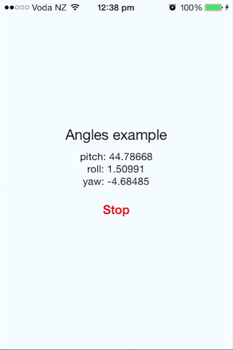

React Native - Device Angles
-------------------------------
Get rotation information (pitch, yaw, roll) - ios

**use**
```
react-native init myProject

cd myProject

npm install react-native-device-angles --save
```
**configure**
open the xcode project from your react-native application ```myProject/ios/myProject.xcode```

right click on Libraries then "add files" then select ```myProject/node_modules/react-native-device-angles/RNDeviceAngles.xcode```

click on your xCode project, then select the build phases tab and inside Link Binary With Libraries add libRNDeviceAngles.a to the list

**code**
```
import { DeviceEventEmitter } from 'react-native';
import { DeviceAngles } from 'NativeModules';

DeviceAngles.setDeviceMotionUpdateInterval(0.1);
...
DeviceAngles.startMotionUpdates();
...
DeviceEventEmitter.addListener('AnglesData', function (data) {
  console.log(data.pitch);
  console.log(data.roll);
  console.log(data.yaw);
});
...
```

**ToDo**
improve this readme

**Screens**



**License**
MIT
